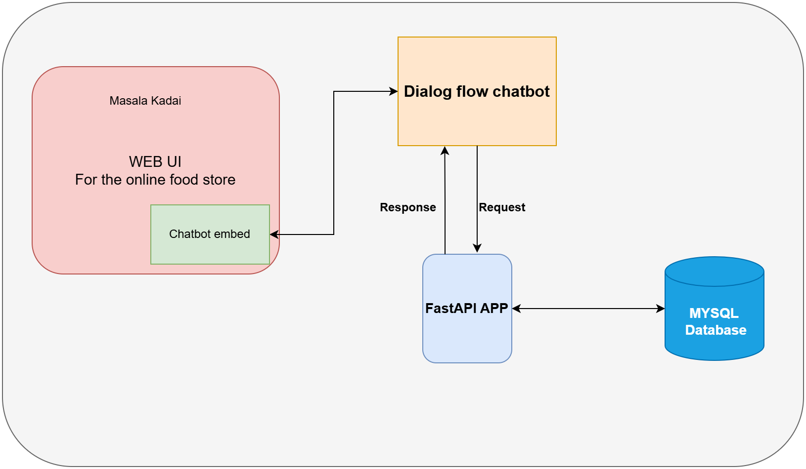

# CHATBOT FOODIE

## Description
This is a chatbot designed for a online food store, This chatbot consists of following features:

1. Web page for interacting with chatbot
2. Place an order
3. Track an order
4. Inquire about store hours

**Note:** 
- This chatbot is intended for a usecase where we know what functionalities(Intents) it needs to handle.
- For more human like interactions, this won't be suitable.

## System Prerequisites
Make sure you have the following installed before running the project:
- Python 3.10+
- MYSQL workbench

## Installation & Setup

### 1. Clone the repository
```sh
git clone https://github.com/Api1998/chatbot-foodie.git
cd chatbot-foodie
```

### 2. Install dependencies
```sh
cd backend_server
pip install -r requirements.txt
```

### 3. Configure MYSQL database client
Please change your credentials in `main.py` to connect with database.
```
db = MySQLClient{
        'host': 'localhost',
        'user': 'your_username',
        'password': 'your_password',
        'database': 'your_database'
    }
```

### 4. Set up the MYSQL database

Use the mysql database dump available inside `db` folder or use your custom database schema

### 5. Set up the chatbot using Dialog flow

Use the training phrases and responses available inside `resources` folder, in a text file called `dialog_flow_phrases.txt`
Use the intents available in the file for defining intents in a dialg flow chatbot agent.

Please refer to the following youtube video from codebasics for a complete setup of the chatbot and system.
- [project setup](https://www.youtube.com/watch?v=2e5pQqBvGco&list=PLeo1K3hjS3uuvuAXhYjV2lMEShq2UYSwX&index=28)

### 6. ngrok for https tunneling

1. To install ngrok, go to https://ngrok.com/download and install ngrok version that is suitable for your OS
2. Extract the zip file and place ngrok.exe in a folder.
3. Open windows command prompt, go to that folder and run this command: ngrok http 8000
4. Use the public link generated in the command line as webhook in dialog flow setup to interact with the fastAPI backend (Refer the same video mentioned in the previous step to see how to do this)

### 7. Run the fastAPI server(APP)

To run the backend server,
```sh
cd backend_server
fastapi dev main.py
```

- It will start your server in the port 8000  (make sure the ngrok tunnel's port and the fastAPi server port are same)

### 8. Interact with the chatbot using the webpage

- Before opening the webpage, you have to use the web do integration embed link from dialog flow and use it in the HTML file available in the `ui` folder. (same youtube video will help you on this).

- Now just open the `index.html` web page in the browser to start interatcting with the chatbot.

-   Watch the demo attached to see how it works.

## System Architecture
Below is a high-level system diagram showing the architecture:



## Demo
Watch a live demo of the project in action:

<video width="600" controls>
  <source src="demo/chatbot_demo.mp4" type="video/mp4">
  Your browser does not support the video tag.
</video>


Note:- If this video doesn't work here or you didn't here any sound. Please feel free to download and watch the demo inside the `demo ` folder.

## Credits

- This project is inspired from `Codebasics` Youtube channel.

`